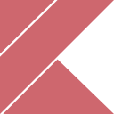

# 👋 Hi there

>I'm Francesco, but you can call me Fra

  - 🏢 Currently working at [SECO Mind](https://www.seco.com/it/seco-mind)
  - 🌱 I’m currently learning Rust, 日本語
  - 💬 I like to talk about data structures
  - ❤ I like:
    - 🔥 Solving problems
    - 🖥 Coding
    - 👾 Indie Games
    - 📽 Video making

### 🚀Favourite Tech

  <table>
      <tr>
          <td align="center">
              
          </td>
          <td align="center">
              
          </td>
          <td align="center">
              
          </td>
          <td align="center">
              
          </td>
          <td align="center">
              
          </td>
          <td align="center">
              
          </td>
          <td align="center">
              
          </td>
      </tr>
      <tr>
          <td align="center">
              
          </td>
          <td align="center">
              
          </td>
          <td align="center">
              
          </td>
          <td align="center">
              
          </td>
          <td align="center">
              
          </td>
          <td align="center">
              
          </td>
          <td align="center">
              
          </td>
      </tr>
  </table>

### 📈 Stats

 
  
💻 GitHub Profile Stats

  

    
  

